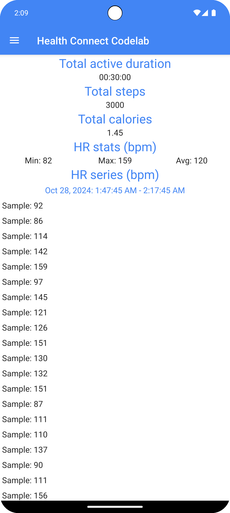
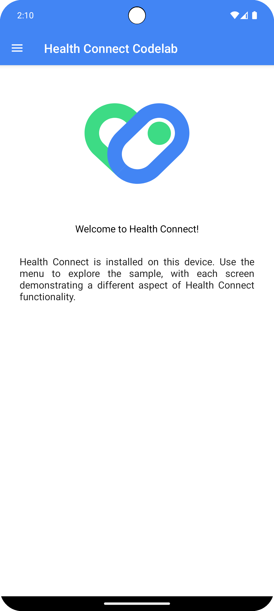
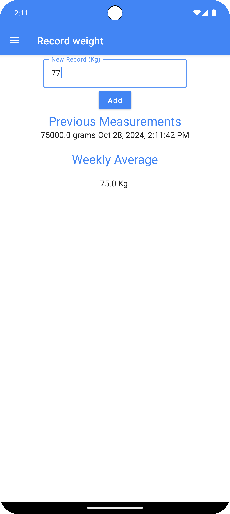

# Health Connect Codelab

This repository contains a codelab to help you get started writing [Health Connect][health-connect] apps for Android.

## Setup

Emulator Android 15 or 16. API as high as possible

## Screenshots

  

